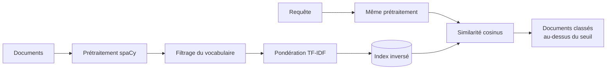
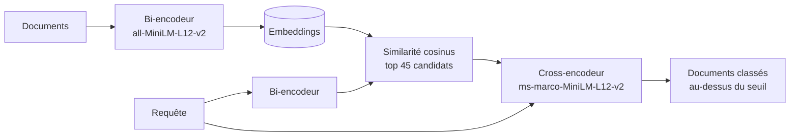

# Moteur de recherche sur le corpus CISI : TF-IDF vs recherche neuronale

Comparaison de deux systèmes de recherche d'information sur le corpus **CISI**, une collection de référence de 1 460 résumés d'articles scientifiques en sciences de l'information, accompagnée de requêtes et de jugements de pertinence.

- **Système 1 : TF-IDF.** Un modèle vectoriel classique, implémenté de A à Z : prétraitement linguistique, index inversé, pondération TF-IDF et similarité cosinus.
- **Système 2 : recherche dense + re-ranking.** Une architecture neuronale en deux étapes, utilisée dans les moteurs de recherche modernes et dans les systèmes RAG : un bi-encodeur sélectionne des candidats, puis un cross-encodeur les reclasse finement.

Projet réalisé en binôme avec **Melissa Boko**, dans le cadre du cours de Traitement Automatique des Langues à l'INSA Rennes.

## Résultats

<!-- Recopie ici les scores obtenus avec eval.pl -->

| Métrique | Système 1 : TF-IDF | Système 2 : dense + re-ranking |
|---|---|---|
| Précision | 15.1 | [17.6 |
| Rappel | 22.8 | 22.3 |
| F-mesure | 18.2 | 19.6 |

**En résumé :** [ex. « le système neuronal améliore la MAP de X points par rapport au TF-IDF, notamment sur les requêtes dont les documents pertinents n'emploient pas les mêmes termes »].

## Système 1 : TF-IDF



**Prétraitement linguistique** avec spaCy : lemmatisation, suppression des mots vides et de la ponctuation, et conservation des seuls noms, noms propres, verbes et adjectifs, qui portent l'essentiel du sens.

**Filtrage du vocabulaire** : les termes présents dans moins de 2 documents (trop rares pour être utiles) ou dans plus de 80 % des documents (trop fréquents pour être discriminants) sont écartés.

**Pondération** : TF logarithmique ($1 + \log n$), qui atténue l'effet des mots répétés, et IDF lissé.

**Recherche** : un index inversé permet de ne calculer la similarité cosinus que pour les documents partageant au moins un terme avec la requête. Seuls les documents dépassant un score de 0,12 sont renvoyés, dans la limite de 50 par requête.

**Limite** : le TF-IDF ne reconnaît que les correspondances exactes de termes. Un document qui parle de *library catalog* ne sera pas retrouvé pour une requête sur *bibliographic record*, même si les sujets sont proches.

## Système 2 : recherche dense et re-ranking



Ce système compare les textes selon leur **sens** et non plus selon les mots qu'ils partagent.

**Étape 1, recherche dense.** Le bi-encodeur `all-MiniLM-L12-v2` transforme chaque document et chaque requête en vecteur, séparément. Les documents ne sont encodés qu'une seule fois, ce qui rend la recherche rapide. On garde les 45 documents les plus proches de la requête.

**Étape 2, re-ranking.** Le cross-encodeur `ms-marco-MiniLM-L12-v2` lit la requête et chaque candidat **ensemble**, ce qui lui permet de juger leur pertinence beaucoup plus finement. Il est plus coûteux, c'est pourquoi il n'est appliqué qu'aux candidats de l'étape 1. Seuls les documents au-dessus d'un seuil de pertinence sont renvoyés.

Ce compromis entre vitesse et précision est le même que celui utilisé dans les pipelines RAG.

## Technologies

| Rôle | Outil |
|---|---|
| Langage | Python |
| Prétraitement linguistique | spaCy (`en_core_web_md`) |
| Modèles neuronaux | SentenceTransformers, PyTorch |
| Environnement | Google Colab (GPU T4 pour le système 2) |

## Structure du dépôt

```
├── notebooks/
│   ├── 01_tfidf.ipynb                       # Système 1
│   └── 02_dense_retrieval_reranking.ipynb   # Système 2
├── data/                                    # Corpus CISI (voir ci-dessous)
└── README.md
```
<!-- Retire la ligne data/ si tu ne publies pas les données -->

## Lancer le projet

1. Ouvre un notebook dans [Google Colab](https://colab.research.google.com/). Pour le système 2, active le GPU (*Exécution > Modifier le type d'exécution > GPU T4*).
2. Place les fichiers du corpus dans `/content` : `CISI.ALLnettoye` (documents), `CISI.QRY` (requêtes) et `CISI_dev.REL` (jugements de pertinence).
3. Exécute toutes les cellules. Chaque notebook produit un fichier de résultats (`run_tfidf.REL` ou `run_dense_rerank.REL`) au format `requête document score`.

**Données :** le corpus CISI est disponible publiquement sur le site des [collections de test de l'université de Glasgow](http://ir.dcs.gla.ac.uk/resources/test_collections/cisi/). La version utilisée ici a été nettoyée dans le cadre du cours. Le script d'évaluation `eval.pl`, fourni par l'équipe pédagogique, n'est pas inclus dans ce dépôt.

## Pistes d'amélioration

- **Recherche hybride** : combiner les scores TF-IDF et neuronaux, pour profiter à la fois des correspondances exactes de termes et de la proximité sémantique.
- **Ajustement des seuils** par validation plutôt que fixés manuellement.
- **Modèles spécialisés** : les modèles utilisés ont été entraînés sur des données généralistes (MS MARCO) ; un modèle adapté aux textes scientifiques pourrait mieux fonctionner.

## Auteurs

- **Amadou Bah** – [GitHub](https://github.com/amadou05bah) · [LinkedIn](https://www.linkedin.com/in/amadou-bah)
- **Melissa Boko** – [GitHub](https://github.com/[pseudo])
<!-- Remplace par le profil de Melissa, ou retire le lien si elle n'en a pas -->
